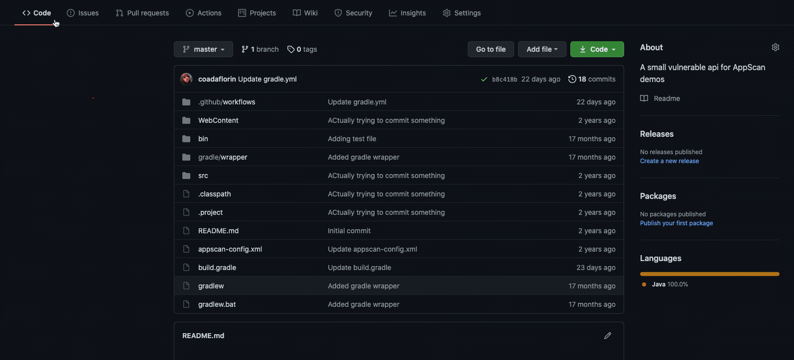

# HCL AppScan SAST Github Action
Your code is better and more secure with HCL AppScan.

The HCL AppScan SAST Github Action enables you to run static analysis security testing (SAST) and software composition analysis (SCA) against the files in your repository. The SAST scan identifies security vulnerabilities in your code and the SCA scan identifies vulnerabilities in your dependencies. Results are stored in AppScan on Cloud or AppScan 360.

# Usage
## Register
If you don't have an account, register on [HCL AppScan on Cloud (ASoC)](https://www.hcltechsw.com/appscan/codesweep-for-github) to generate your API key and API secret. Not required for AppScan 360.

## Setup
1. Generate your API key and API secret on [the API page](https://cloud.appscan.com/main/settings).
- The API key and API secret map to the `asoc_key` and `asoc_secret` parameters for this action. Store the API key and API secret as [secrets](https://docs.github.com/en/actions/security-guides/encrypted-secrets) in your repository.

2. Create the application in ASoC or AppScan 360. 
- The application ID in ASoC/AppScan 360 maps to application_id for this action.

# Required Inputs
| Name |   Description    |
|    :---:    |    :---:    |
| asoc_key | Your API key from [the API page](https://cloud.appscan.com/main/settings) |
| asoc_secret | Your API secret from [the API page](https://cloud.appscan.com/main/settings) |
| application_id | The ID of the application in ASoC or AppScan 360. |

# Optional Inputs
| Name | Description | Default Value |
|    :---:    |    :---:    |    :---:    |
| service_url | The url for connections to AppScan 360. Not required for connections to AppScan on Cloud (ASoC) | https://cloud.appscan.com |
| acceptssl | Allow connections to an AppScan 360 service with an untrusted certificate. Recommended for testing purposes only. | false |
| scan_name | The name of the scan created in ASoC. | The GitHub repository name |
| personal_scan | Make this a [personal scan](https://help.hcltechsw.com/appscan/ASoC/appseccloud_scans_personal.html). | false |
| static_analysis_only | Only run static analysis. Do not run SCA (Software Composition Analysis). | false |
| open_source_only | Only run SCA (Software Composition Analysis). Do not run static analysis. | false |
| secrets_only | Only scan for secrets. Do not run static analysis or software composition analysis. | false |
| scan_build_outputs | By default only source code files will be analyzed. Enabling this option will result in build output files for Java and .NET to be analyzed (.jar/.war/.ear/.dll/.exe). Additionally, Maven, Gradle, and Visual Studio solutions will be built if the build environment is available. | false |
| wait_for_analysis | By default this action will initiate the scan in ASoC, but it will not wait for analysis to complete. Enabling this option will cause the action to wait for analysis to complete. Note that this will cause the action to run longer. | false |
| analysis_timeout_minutes | If **wait_for_analysis** is true, the number of minutes to wait for analysis to complete. | 30 minutes |
| fail_for_noncompliance | If **wait_for_analysis** is true, fail the job if any non-compliant issues are found in the scan. | false |
| failure_threshold | If **fail_for_noncompliance** is enabled, the severity that indicates a failure. Lesser severities will not be considered a failure. For example, if **failure_threshold** is set to Medium, Informational and/or Low severity issues will not cause a failure. Medium, High, and/or Critical issues will cause a failure. | Low |

# Examples
```yaml
name: "HCL AppScan SAST"
on:
  workflow_dispatch
jobs:
  scan:
    runs-on: ubuntu-latest
    steps:
      - name: Checkout
        uses: actions/checkout@v4
      - name: Run AppScan SAST scan
        uses: HCL-TECH-SOFTWARE/appscan-sast-action@v1.0.7
        with:
          asoc_key: ${{secrets.ASOC_KEY}}
          asoc_secret: ${{secrets.ASOC_SECRET}}
          application_id: e35ea96d-cae0-499a-a3ed-7a4efd77b269
```
